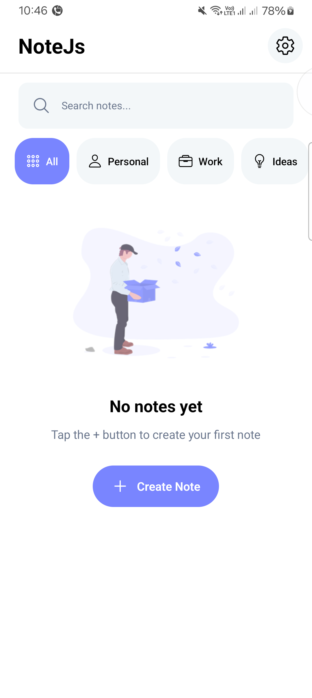
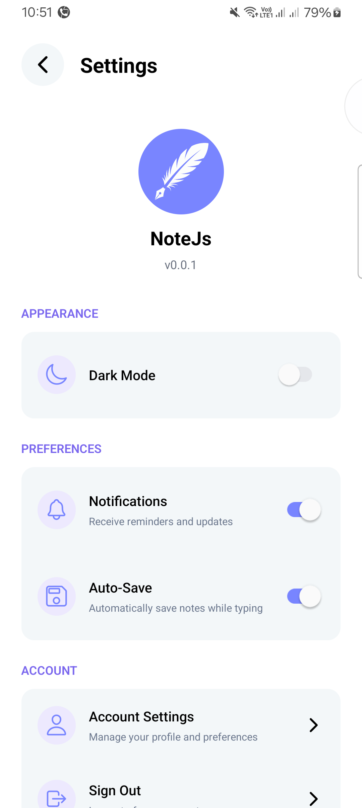
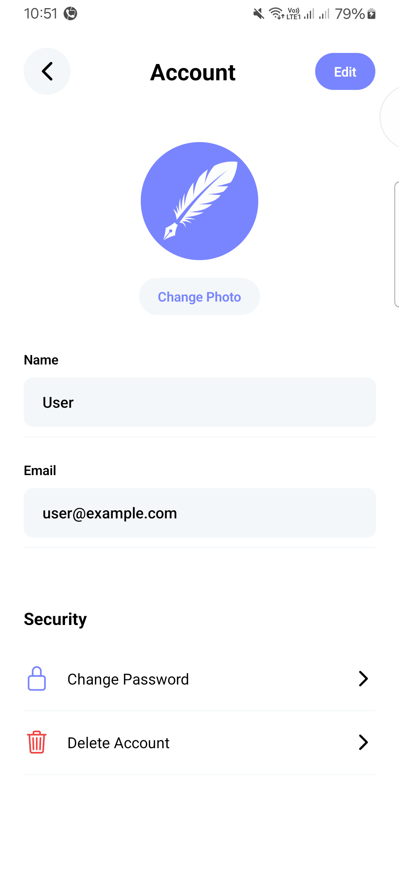
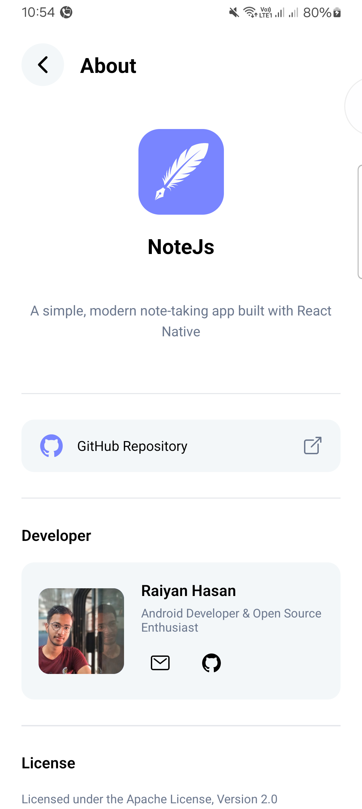

# NoteJS - A Simple Notes App

NoteJS is a basic notes application built with React Native and Expo. It allows users to create, edit, delete, and save notes locally on their device.

## Features

*   **Authentication:** Simple authentication flow with login and signup screens. Uses a dummy token for demonstration purposes

  ```
 Username: user
 Password: password
```
*   **Note Creation:** Create new notes with a title and content.
*   **Note Editing:** Edit existing notes.
*   **Note Deletion:** Delete notes.
*   **Local Storage:** Notes are stored locally using AsyncStorage.
*   **Dark Mode:** Toggle between light and dark mode.

## Technologies Used

*   React Native
*   Expo
*   React Navigation
*   AsyncStorage

## Project Structure

```
NoteJS/
├── .gitignore
├── App.js
├── app.json
├── index.js
├── package-lock.json
├── package.json
├── README.md
├── assets/
│   └── images/
│       ├── empty-box-dark.png
│       ├── empty-box.png
│       └── icon.png
├── constants/
│   └── constants.js
├── context/
│   ├── AuthContext.js
│   └── ThemeContext.js
└── screens/
    ├── HomeScreen.js
    ├── SplashScreen.js
    ├── LoginScreen.js
    └── SignupScreen.js

```

## Screenshots

Here are some screenshots of the app:

<div style="display: flex; flex-wrap: wrap; justify-content: center; gap: 20px; padding: 20px; border: 2px solid #ccc;">
  
  
  
  

 
      
  


</div>

*From left to right: Splash Screen, Login Screen, and Signup Screen.*

## Setup

1.  Install dependencies:

    ```bash
    npm install
    ```

2.  Start the application:

    ```bash
    expo start
    ```

## Development Phases

This project is being developed in phases to allow for focused development and iterative improvements. Here's a breakdown of the planned phases:

**Phase 1: Core Functionality and User Interface (Implemented)**

*   **Goal:** Establish the fundamental note-taking features and a basic user interface.
*   **Features:**
    *   Simple authentication (dummy token).
    *   Login and Signup screens.
    *   Note creation, editing, and deletion.
    *   Local storage of notes using AsyncStorage.
    *   Basic Home Screen to display notes.
    *   Dark Mode toggle.
    *   Basic styling and layout.

**Phase 2: User Experience Enhancements**

*   **Goal:** Improve the user experience and polish the existing features.
*   **Planned Features:**
    *   **Enhanced UI/UX:** Refine the user interface for better usability and visual appeal.
    *   **Improved Note Editing:** Potentially add features like auto-saving and better text input handling.
    *   **Search Functionality:** Implement a basic search feature to find notes by title or content.
    *   **Error Handling & User Feedback:** Improve error messages and provide better feedback to the user during actions.

**Phase 3: Advanced Features and Cloud Sync (Coming Soon)**

*   **Goal:** Introduce more advanced features and enable note synchronization across devices.
*   **Planned Features:**
    *   **Cloud Storage:** Integrate cloud storage (e.g., Firebase, AWS, custom backend) to sync notes across devices.
    *   **Secure Authentication:** Replace the dummy token with a more secure authentication method (email/password, OAuth).
    *   **Rich Text Editor:** Implement a rich text editor for formatting notes (bold, italics, lists, etc.).
    *   **Tagging and Categorization:** Allow users to tag and categorize notes for better organization.

**Phase 4: Notifications and Reminders (Future Enhancements)**

*   **Goal:** Add features to enhance note utility and user engagement.
*   **Planned Features:**
    *   **Push Notifications:** Implement push notifications for reminders or updates on notes.
    *   **Note Reminders:** Allow users to set reminders for specific notes.
    *   **Sharing Notes:** Potentially enable sharing notes with other users (future consideration).

**Subsequent Phases (Future Considerations)**

*   Further enhancements and features will be considered based on user feedback and project goals. This could include features like collaborative editing, web app version, etc.


## Notes

*   This is a simplified notes application and does not yet include features such as cloud storage or advanced editing capabilities (these are planned for future phases).
*   The authentication in Phase 1 is implemented with a dummy token and is not secure. The username is "user" and the password is "password".  **Phase 3 will address secure authentication.**
*   We are actively developing NoteJS in phases. Stay tuned for updates and new features in upcoming phases!
