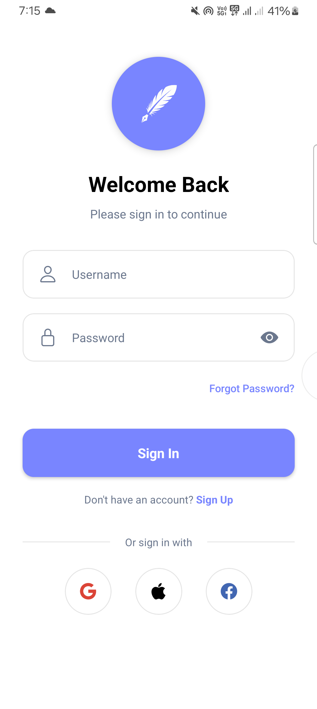
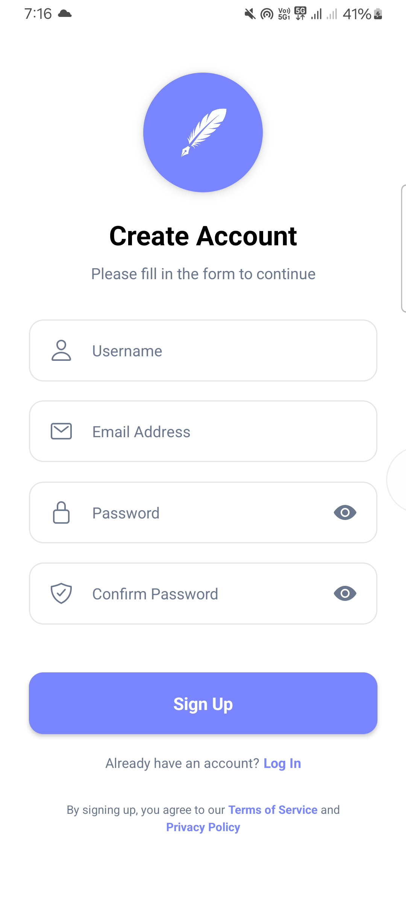
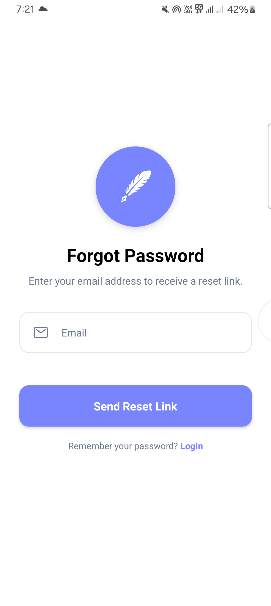

# NoteJS - A Simple Notes App

NoteJS is a basic notes application built with React Native and Expo. It allows users to create, edit, delete, and save notes locally on their device.

## Features

*   **Authentication:** Simple authentication flow with login and signup screens. Uses a dummy token for demonstration purposes.
*   **Note Creation:** Create new notes with a title and content.
*   **Note Editing:** Edit existing notes.
*   **Note Deletion:** Delete notes.
*   **Local Storage:** Notes are stored locally using AsyncStorage.
*   **Dark Mode:** Toggle between light and dark mode.

## Technologies Used

*   React Native
*   Expo
*   React Navigation
*   AsyncStorage

## Project Structure

```
NoteJS/
├── .gitignore
├── App.js
├── app.json
├── index.js
├── package-lock.json
├── package.json
├── README.md
├── assets/
│   └── images/
│       ├── empty-box-dark.png
│       ├── empty-box.png
│       └── icon.png
├── constants/
│   └── constants.js
├── context/
│   ├── AuthContext.js
│   └── ThemeContext.js
└── screens/
    ├── HomeScreen.js
    ├── SplashScreen.js
    ├── LoginScreen.js
    └── SignupScreen.js

```


## Screenshots

Here are some screenshots of the app:

<div style="display: flex; flex-wrap: wrap; justify-content: center; gap: 20px; padding: 20px; border: 2px solid #ccc;">
  
  
  
  
</div>

*Splash Screen showing the list of notes.*  
*Login Screen for authentication.*
## Setup

1.  Install dependencies:

    ```bash
    npm install
    ```

2.  Start the application:

    ```bash
    expo start
    ```

## Notes

*   This is a simplified notes application and does not include features such as cloud storage or advanced editing capabilities.
*   The authentication is implemented with a dummy token and is not secure. The username is "user" and the password is "password".
*   **Coming Soon:**
    * Cloud storage for syncing notes across devices.
    * Rich text editor for more advanced note formatting.
    * Push notifications for reminders or updates on notes.
    * Secure authentication with email/password or third-party OAuth.
    * Tagging and categorizing notes for better organization.
